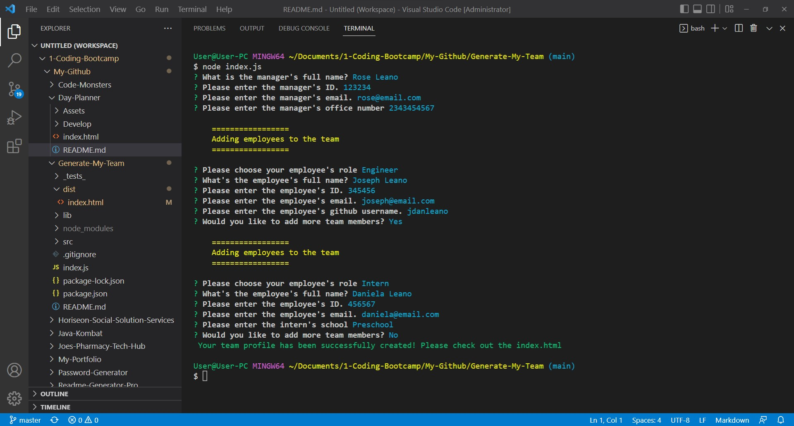
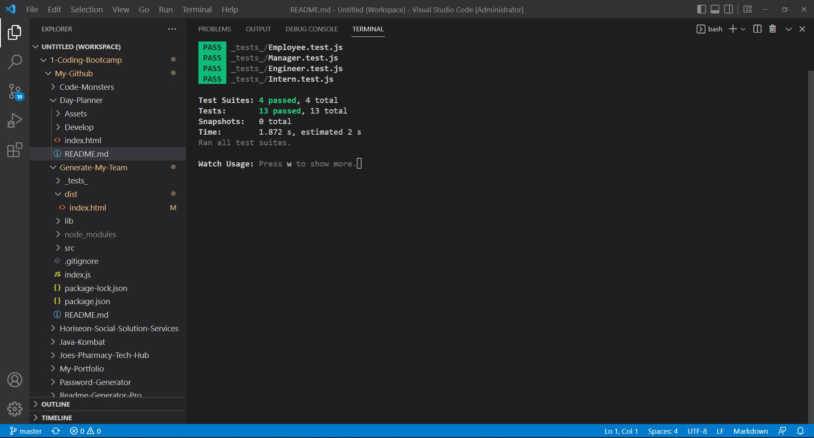
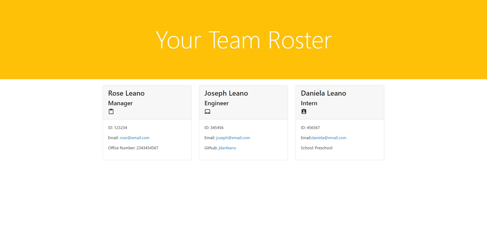

# Generate My Team - Module 10 Challenge
Create your team of misfit coders

## Mock Up







This is my completed code for the Module 10 challenge this week. We were given a task this week to create a team generator page using node, inquirer, and to use Jest to test out code.

## User Story

```
AS A manager I WANT to generate a webpage that displays my team's basic info SO THAT I have quick access to their emails and GitHub profiles
```

The Acceptance Criteria is as follows:

## Acceptance Criteria

```
GIVEN a command-line application that accepts user input
WHEN I am prompted for my team members and their information
THEN an HTML file is generated that displays a nicely formatted team roster based on user input
WHEN I click on an email address in the HTML
THEN my default email program opens and populates the TO field of the email with the address
WHEN I click on the GitHub username
THEN that GitHub profile opens in a new tab
WHEN I start the application
THEN I am prompted to enter the team manager’s name, employee ID, email address, and office number
WHEN I enter the team manager’s name, employee ID, email address, and office number
THEN I am presented with a menu with the option to add an engineer or an intern or to finish building my team
WHEN I select the engineer option
THEN I am prompted to enter the engineer’s name, ID, email, and GitHub username, and I am taken back to the menu
WHEN I select the intern option
THEN I am prompted to enter the intern’s name, ID, email, and school, and I am taken back to the menu
WHEN I decide to finish building my team
THEN I exit the application, and the HTML is generated
```

This application utilizes Inquirer 8.2.4 npm module. Jest npm module is also used to run tests. It will also open the github usernames in the HTML to their github profile link.


## Please see attached links to Repository and Video Walkthrough:
### https://github.com/jdanleano/Generate-My-Team
### https://youtu.be/DHH7E-QcY0U